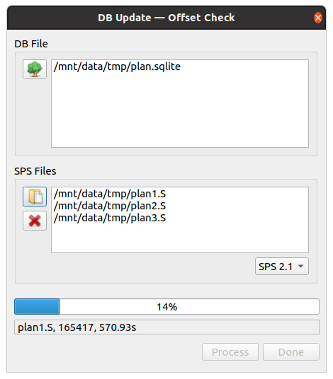
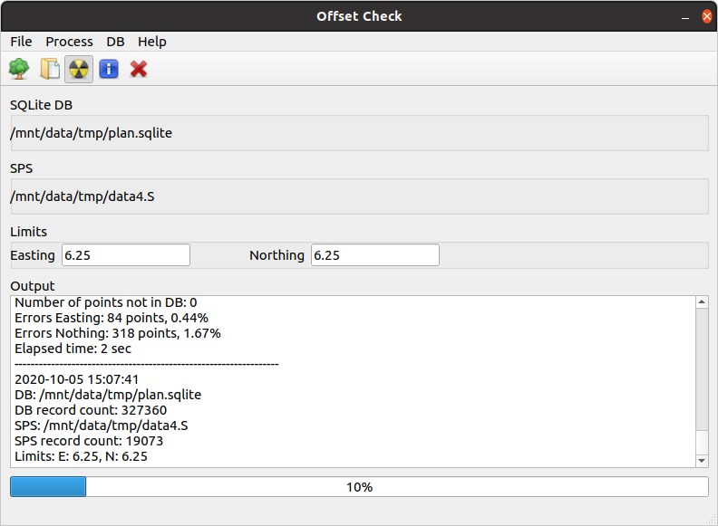

# Seismic Offset Check

### Database operations
1. create DB: menu _**DB->Create DB**_ - creates SQLite DB file and table structure
2. update DB: menu _**DB->Update DB**_ - select DB to update and all SPS files you want to load (preplot, operation plan, etc)



### Check
1. select DB
2. select SPS file
3. set Easting & Northing limits accordingly
3. Run

Output files are created in the same folder where SPS file is.



There are 3 types of output files:
* **.check.csv** - contains all checked records with Easting & Northing diffs and error flags accordingly to limit
* **.not-in-db.csv** - contains all records that could not be find in DB
* **.check.log** - contains all information what has been checked

Example of log file
```
2020-10-05 16:11:47
DB: /mnt/data/tmp/plan.sqlite
DB record count: 327360
SPS: /mnt/data/tmp/data4.S
SPS record count: 19073
Limits: E: 6.25, N: 6.25
Number of points: 19073
Number of points not in DB: 0
Errors Easting: 84 points, 0.44%
Errors Nothing: 318 points, 1.67%
Elapsed time: 2 sec
```